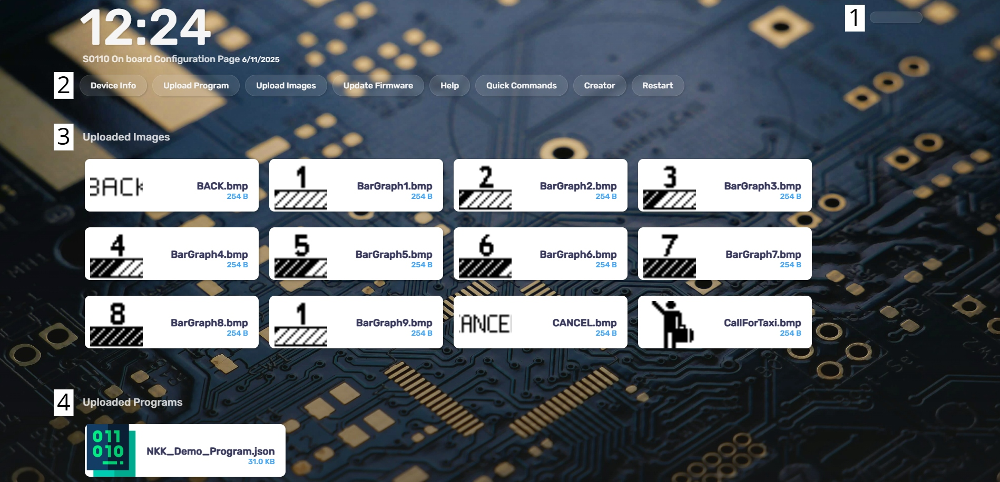
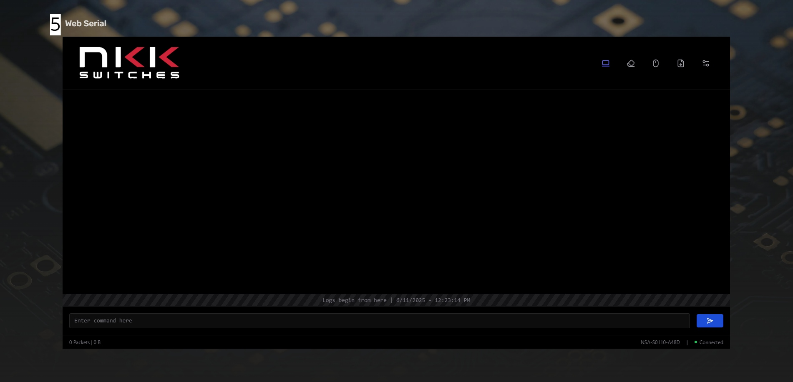

import { LinkCard, Aside, Steps, Tabs, TabItem } from '@astrojs/starlight/components';


This page will explain how to use the onboard program creator. To get started you will need to have one of our Wi-Fi enabled products and access the on board we portal. 

<Aside>This guide is only for our Wi-Fi enabled product line. For non Wi-Fi devices and more detailed device information and guides, please go to the respective page for that product.</Aside>

## Connecting to the device

<Steps>

1. Connect to the access point. By Default this is a open network and will have no internet connection. XXXX will represent a unique number for each device. 

   <Tabs syncKey="S0110">

   <TabItem label="S0110">

   ```sh
	SSID: NSA-S0110-XXXX
   ```

   </TabItem>

   <TabItem label="CU6401">

	```sh
	SSID: NSA-CU6401-XXXX
   ```

   </TabItem>

   </Tabs>

2. Once the device has successfully connected, open your browser and connect to the ondevice portal.
	<Tabs syncKey="S0110">

   <TabItem label="S0110">

   ```sh
	http://nsa-s0110.local/
   ```

   </TabItem>

   <TabItem label="CU6401">

	```sh
	http://nsa-cu6401.local/
   ```

   </TabItem>

   </Tabs>

3. After the page connects you will be greeted with the login page. 
	

</Steps>

<Aside type="caution"> In the event the ondevice portal does not show up after typing in the URL, please verify you are still connected to the local network.</Aside>
<Aside>From this point on, we will be demastrating the features of the ondevice portal on the S0110. </Aside>
<LinkCard title="S0110" href="/docs/products/solutions/s0110/"  description="More indepth information about the S0110 is available on the product page." />
## Understanding the UI

### Homepage



### Navigation Menu
* 1. Logout Button
* 2. Links to look at device information, access the program creator, upload images, programs and firmware updates, send quick commands and to restart the device. 
### Image List
* 3. This section will display all of the images uploaded to the flash memeory of the device. 
### Program List
* 4. This section will display all of the programs uploaded to the flash memeory of the device. 
### Web Serial
* 5. The onboard serial monitor. Each device has their own commands, please see the product page to learn about the commands for each device.